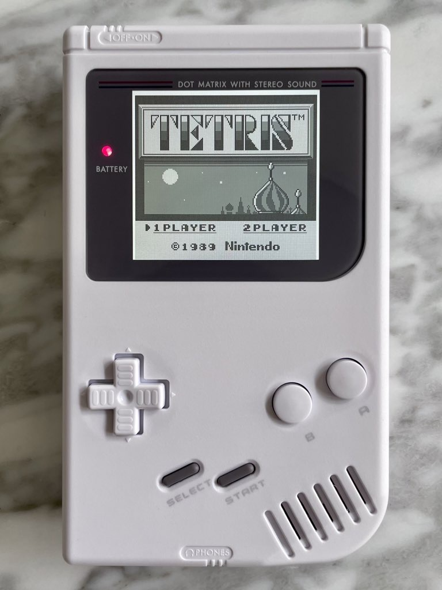

This was my first original Game Boy mod, but the first Game Boy I'd ever worked on. In 2019, I decided to crack open an old, broken original Game Boy I had lying around to see if I could fix it. (I think it was my step-brother's old Game Boy.) You can read about that process on my post [Game Boy Restored](/2019/04/21/game-boy-restored/).

In an effort to match my person Game Boy Advance, I decided to add an [IPS display](https://funnyplaying.com/collections/product/products/dmg-retro-pixel-ips-lcd-kit) and swap the casing of this unit using [FunnyPlaying's Game Boy Housing and Button combos](https://funnyplaying.com/collections/product/products/for-gb-ips-housing-and-lens-combination).
