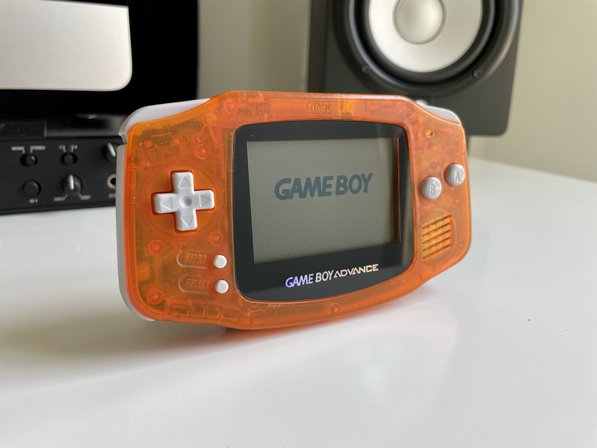

When I picked up a broken one, I had no idea what I’d come across. It’s only fitting to wind up in your hands.
This unit was in particularly bad shape when I opened it up. There was a large amount of corrosion on the start/select pads and gunk throughout. The headphone jack also had large amounts of corrosion and was preventing the audio from being sent to the speaker. Needless to say, these issues have now been resolved, along with the following repairs and restorations:

- [Buttons by FunnyPlaying](https://funnyplaying.com/collections/product/products/agb-custom-buttons)
- [Silicone Pads by Funnyplaying](https://funnyplaying.com/collections/product/products/replacement-silicone-pads-for-gameboy-advance)
- [New glass screen](https://funnyplaying.com/collections/product/products/centering-lens-for-ips-lcd-gameboy-advance)
- [New stock capacitors](https://console5.com/store/game-boy-advance-smd-cap-kit-gba.html)
- [New battery cover](https://handheldlegend.com/products/game-boy-advance-battery-cover)
- Cleaned power switch
