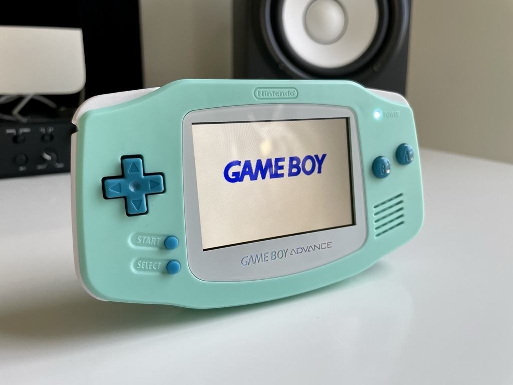

This might be my favorite GBA color palette yet! Initially, I attempted to use a shell by RetroSix, but was disappointed by the display mounting solution and bad branding. Thankfully, I was able to track down a sold out light blue FunnyPlaying shell — the preferred shell of most modders — which also fits the FunnyPlaying glass nicely.

The logic board in came from an AGB-001 — the first run of GBAs produced in 2001. It was in extremely good condition, save a dirty power switch which prevented it from powering on, and a defective right-shoulder button. I believe this is the first AGB-001 unit I’ve worked on.

With that, here’s a breakdown of the full mod:

- [New IPS LCD w/ brightness controls (select + L/R) by FunnyPlaying](https://funnyplaying.com/collections/product/products/gba)
- [New speaker by FunnyPlaying](https://funnyplaying.com/collections/product/products/clear-gba-speaker)
- [Shell by FunnyPlaying](https://funnyplaying.com/collections/product/products/mirror-clear-coustom-shell-for-gba)
- [Buttons by FunnyPlaying](https://funnyplaying.com/collections/product/products/agb-custom-buttons)
- [Buttons by RetroSix](https://handheldlegend.com/products/game-boy-advance-prestige-buttons-1)
- [Silicone Pads by Funnyplaying](https://funnyplaying.com/collections/product/products/replacement-silicone-pads-for-gameboy-advance)
- [White power LED mod](https://lighthouseleds.com/catalogsearch/result/?q=0603+SMD)
- [New glass screen](https://funnyplaying.com/collections/product/products/centering-lens-for-ips-lcd-gameboy-advance)
- [New stock capacitors](https://console5.com/store/game-boy-advance-smd-cap-kit-gba.html)
- [Power Cleaner Flex by Helder](https://heldergametech.com/shop/gba/gba-power-cleaner-flex-pcb/)
- [One dehum/dehiss capacitor by RetroSix](https://retrosix.co.uk/Dehum-Dehiss-Kit-Game-Boy-Advance-p217244008)
- Replaced R-shoulder button with salvaged button
- Cleaned power switch
