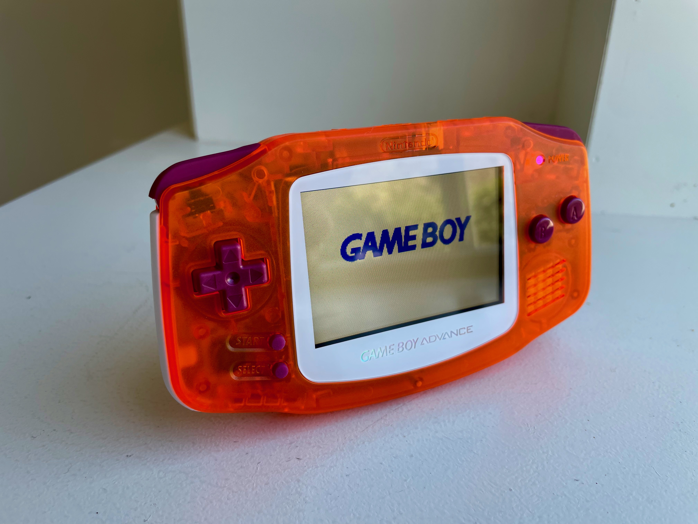

The _Game Boy Advance, Sunset_ was a commission build themed after a sunset. This was a challengeing build as I wanted to mimmick the gradient of a sunset. The buyer and I played around with several versions from reds, purples, and pinks, eventually landing on an orange shell, maroon buttons, pink LED, and white accents for clouds.

Unfortunately, I don't have build notes from this unit.
