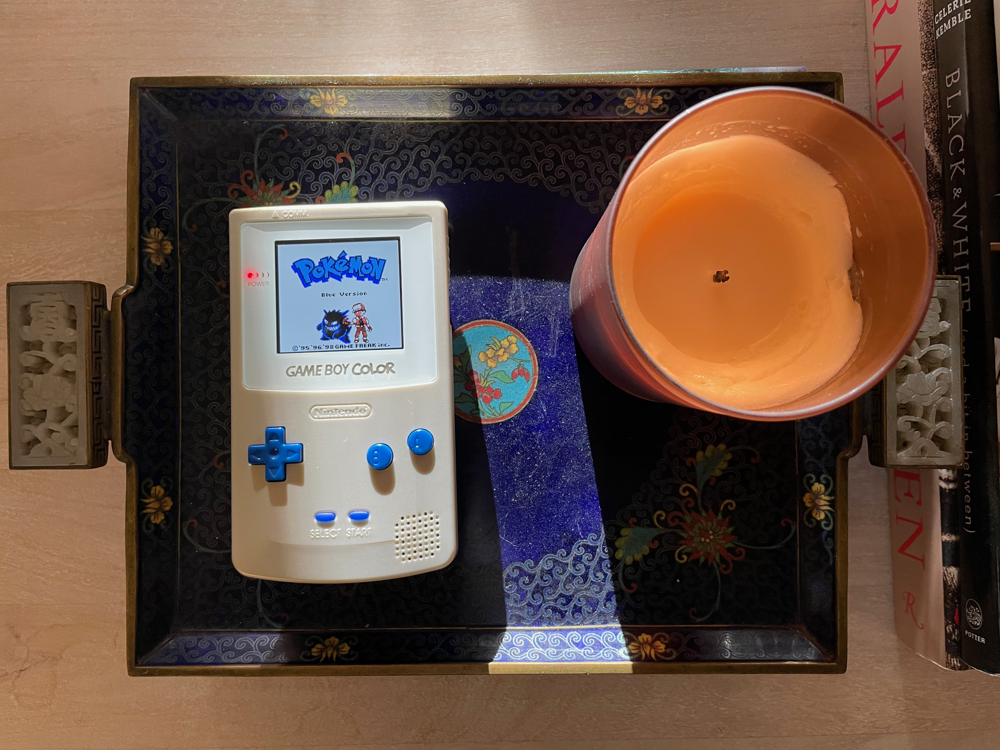

The Game Boy Color, Blue/Gold Version was a gift for a dear friend and [former podcast co-host](https://podcasts.apple.com/us/podcast/ported/id1092918272). It was inspired from an episode of our show where we discussed our fondness and memories of Pokémon Blue. I chose a gold shell because a) it was the only color available at the time and b) it played homage to the Pokémon Red/Blue sequel, Gold/Silver.
