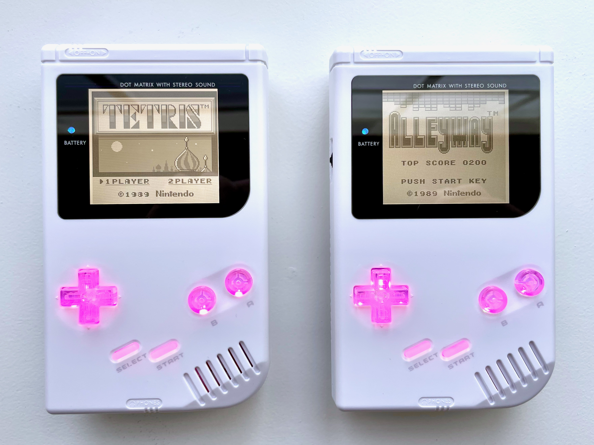

I was humbled when [NovaNine](https://novanine.bandcamp.com) asked for a custom Game Boy mod to commemorate [their debut album](https://novanine.bandcamp.com/album/novanine). To fit the record’s ‘80s synthwave aesthetic, NovaNine and I settled on the original Game Boy (DMG) from ’89 as the base.

This was my first mod with LED backlit buttons. I wanted to highlight the album cover’s glowing retrowave sun. Luckily, I was able to find some of [Natalie the Nerd](https://www.nataliethenerd.com)’s awesome DMG LED flex boards — custom flexible PCB boards with perfectly placed LED lights. Paired with a blue LED power light, this Game Boy vibes like NovaNine.

Nova198Nine includes:

- [FunnyPlaying DMG Retro Pixel IPS LCD Kit](https://funnyplaying.com/collections/product/products/dmg-retro-pixel-ips-lcd-kit)
- [FunnyPlaying Game Boy Housing and Button combo](https://funnyplaying.com/collections/product/products/for-gb-ips-housing-and-lens-combination)
- [FunnyPlaying DMG speaker](https://funnyplaying.com/collections/product/products/clear-dmg-speaker)
- [FunnyPlaying GB DMG Buttons](https://funnyplaying.com/collections/product/products/gb-dmg-custom-buttons)
- [Lab Fifteen clear silicone button pads](https://labfifteenco.com/en-us/products/game-boy-dmg-silicone-clear)
- [FunnyPlaying DMG Retro Pixel IPS glass lens](https://funnyplaying.com/collections/product/products/dmg-retro-pixel-ips-glass-lens)
- [Pink DMG LED Board by Natalie the Nerd](https://www.nataliethenerd.com/product-page/dmg-led-boards)
- [Blue 0603 SMD ultra bright power LED from Lighthouse LEDs](https://lighthouseleds.com/0603-smd-led-blue-ultra-bright-140-mcd.html)

Note: In DMGs, the new display requires more power than the original display, thus increasing the noise floor. Buzzing from the speaker is a normal side effect.

