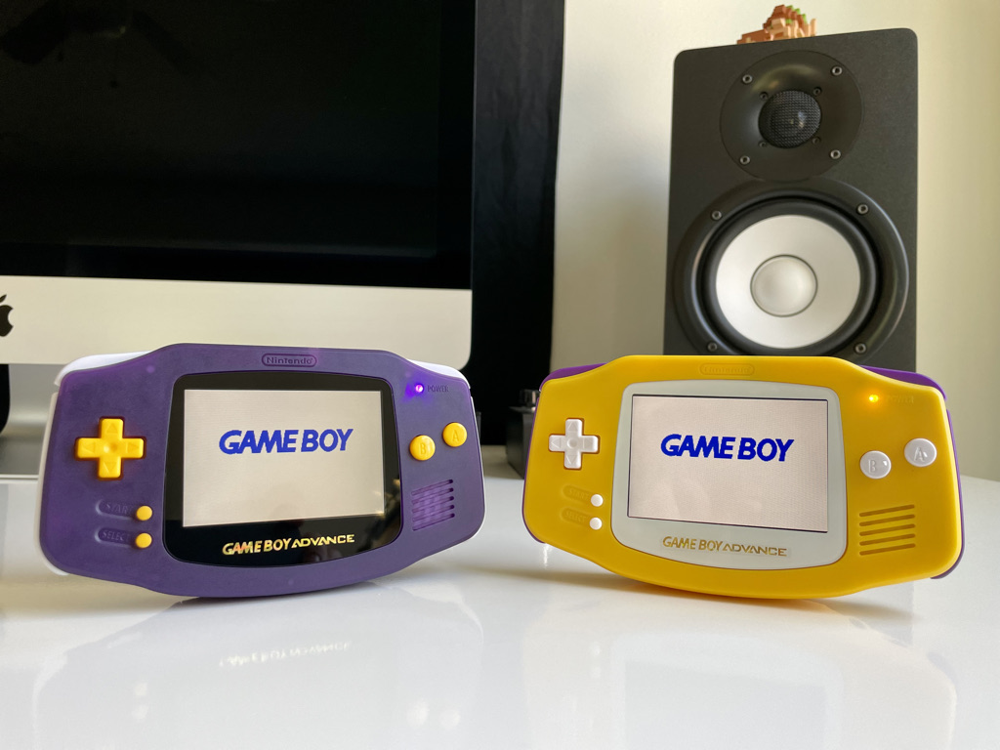

The Resties Boy Advances were commissoned companion pieces for the launch of [The Besties: Resties podcast](https://podcasts.apple.com/us/podcast/the-besties/id505516789), inspired by its magnificent cover art.

These builds include:

- [New IPS LCD w/ brightness controls (select + L/R) by FunnyPlaying](https://funnyplaying.com/collections/product/products/gba)
- [New speaker by FunnyPlaying](https://funnyplaying.com/collections/product/products/clear-gba-speaker)
- [Shell by FunnyPlaying](https://funnyplaying.com/collections/product/products/mirror-clear-coustom-shell-for-gba)
- [Buttons by FunnyPlaying](https://funnyplaying.com/collections/product/products/agb-custom-buttons)
- [Silicone Pads by Funnyplaying](https://funnyplaying.com/collections/product/products/replacement-silicone-pads-for-gameboy-advance)
- [Yellow and purple power LED mod](https://lighthouseleds.com/catalogsearch/result/?q=0603+SMD)
- [New glass screen](https://funnyplaying.com/collections/product/products/centering-lens-for-ips-lcd-gameboy-advance)
- [New stock capacitors](https://console5.com/store/game-boy-advance-smd-cap-kit-gba.html)
- [Power Cleaner Flex by Helder](https://heldergametech.com/shop/gba/gba-power-cleaner-flex-pcb/)
- [One dehum/dehiss capacitor by RetroSix](https://retrosix.co.uk/Dehum-Dehiss-Kit-Game-Boy-Advance-p217244008)
- Cleaned power switch
