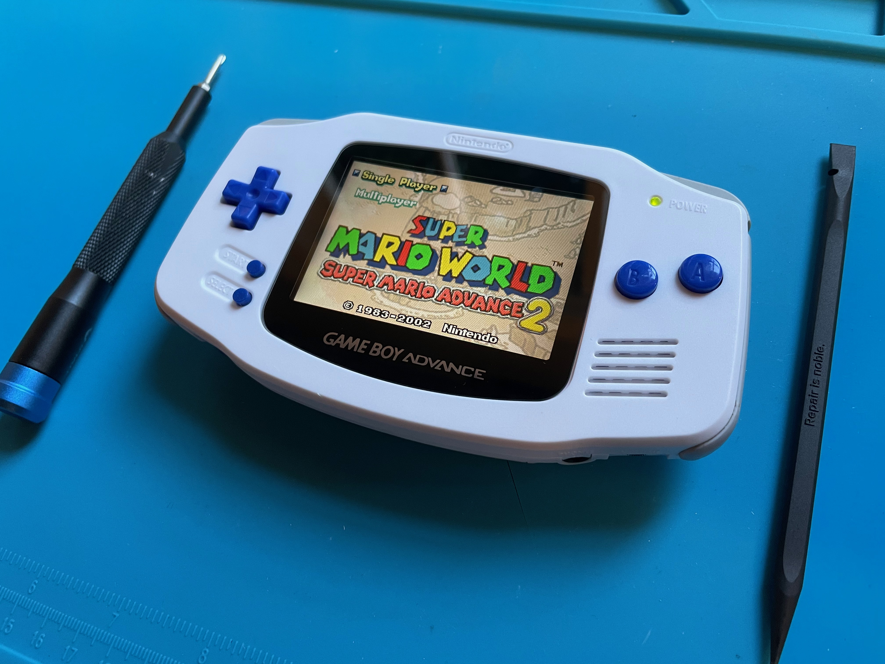

This is my first Game Boy mod. About six months into the pandemic, I had a hankering to play some old Game Boy Advance games; namely Final Fantasy Tactics Advance. But I also had an itch to start an project that involved using my hands. Maybe the isolation behind a computer had gotten the best of me. Needless to say, I bought a functioning Game Boy Advance from [DKOldies](https://www.dkoldies.com/game-boy-advance-systems/) and an [IPS display from FunnyPlaying](https://funnyplaying.com/collections/product/products/gba) and got to work.

For the first version of this mod, I carved out the necessary plastic to replace the display in the original shell. (The IPS displays are slightly larger than the original displays.) Unsatisfied with my trimming, I later decided to replace the shell with a FunnyPlaying after-market [shell](https://funnyplaying.com/collections/product/products/agb-ips-coustom-shell), [buttons](https://funnyplaying.com/collections/product/products/agb-custom-buttons), and [silicone](https://funnyplaying.com/collections/product/products/replacement-silicone-pads-for-gameboy-advance). Any mods that required soldering would come later.
