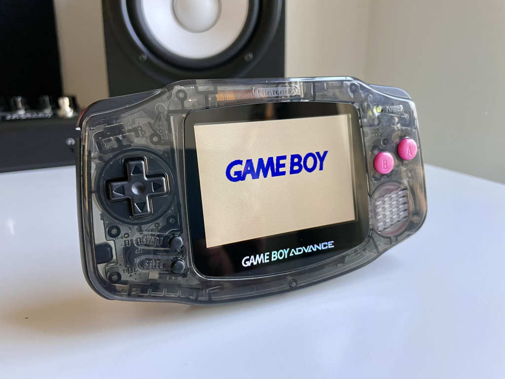

As a fan of [_Into the Aether_](https://intothecast.online), it excited me to no end to play a small role in the show. When Brendon and Stephen asked me to build three Game Boy Advance units for a giveaway on the [Season 4 kickoff GBA episode](https://podcasts.apple.com/us/podcast/into-the-aether/id1415546090?i=1000526818592), I was over the moon. The podcast has provided me much needed levity during heavy times and feels like I’m hanging out with friends more than listening to a show.

_The Whale_ comes inspired by the whale featured on the cover art of _Into the Aether_ Seasons 3 and 4 by [Scout Wilkinson](https://scoutwilkinson.myportfolio.com). The clear black shell + solid button build is the exact opposite of the companion [_White Whale_](/gameboys/the-white-whale) build which features a solid white shell + clear buttons.

In total, _The Whale_ includes:

- [New IPS LCD w/ brightness controls (select + L/R) by FunnyPlaying](https://funnyplaying.com/collections/product/products/gba)
- [New speaker by FunnyPlaying](https://funnyplaying.com/collections/product/products/clear-gba-speaker)
- [Shell by FunnyPlaying](https://funnyplaying.com/collections/product/products/mirror-clear-coustom-shell-for-gba)
- [Prestige Buttons by RetroSix](https://handheldlegend.com/products/game-boy-advance-prestige-buttons-1)
- [New glass screen](https://funnyplaying.com/collections/product/products/centering-lens-for-ips-lcd-gameboy-advance)
- [New stock capacitors](https://console5.com/store/game-boy-advance-smd-cap-kit-gba.html)
- [Power Cleaner Flex by Helder](https://heldergametech.com/shop/gba/gba-power-cleaner-flex-pcb/)
- [One dehum/dehiss capacitor by RetroSix](https://retrosix.co.uk/Dehum-Dehiss-Kit-Game-Boy-Advance-p217244008)
- Cleaned power switch
