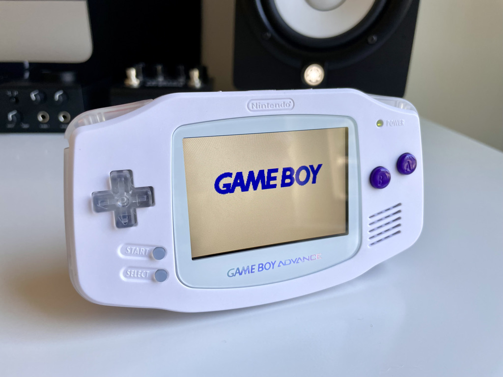

As a fellow fan of Into the Aether, it excites me to no end to play a small role in the show. When Brendon and Stephen asked me to build three Game Boy Advance units for a giveaway, I was over the moon. The podcast has provided me much needed levity during heavy times and feels like I’m hanging out with friends more than listening to a show. I’m sure your feelings are no different.

The White Whale comes inspired by the ongoing theme of “white whale” games that Brendon and Stephen are chasing. The solid white shell + clear button build is the exact opposite of the companion Whale build which features a clear black shell + solid buttons. In total, The White Whale includes:

- [New IPS LCD w/ brightness controls (select + L/R) by FunnyPlaying](https://funnyplaying.com/collections/product/products/gba)
- [New speaker by FunnyPlaying](https://funnyplaying.com/collections/product/products/clear-gba-speaker)
- [Shell by FunnyPlaying](https://funnyplaying.com/collections/product/products/mirror-clear-coustom-shell-for-gba)
- [Prestige Buttons by RetroSix](https://handheldlegend.com/products/game-boy-advance-prestige-buttons-1)
- [New glass screen](https://funnyplaying.com/collections/product/products/centering-lens-for-ips-lcd-gameboy-advance)
- [New stock capacitors](https://console5.com/store/game-boy-advance-smd-cap-kit-gba.html)
- [Power Cleaner Flex by Helder](https://heldergametech.com/shop/gba/gba-power-cleaner-flex-pcb/)
- [One dehum/dehiss capacitor by RetroSix](https://retrosix.co.uk/Dehum-Dehiss-Kit-Game-Boy-Advance-p217244008)
- Cleaned power switch
