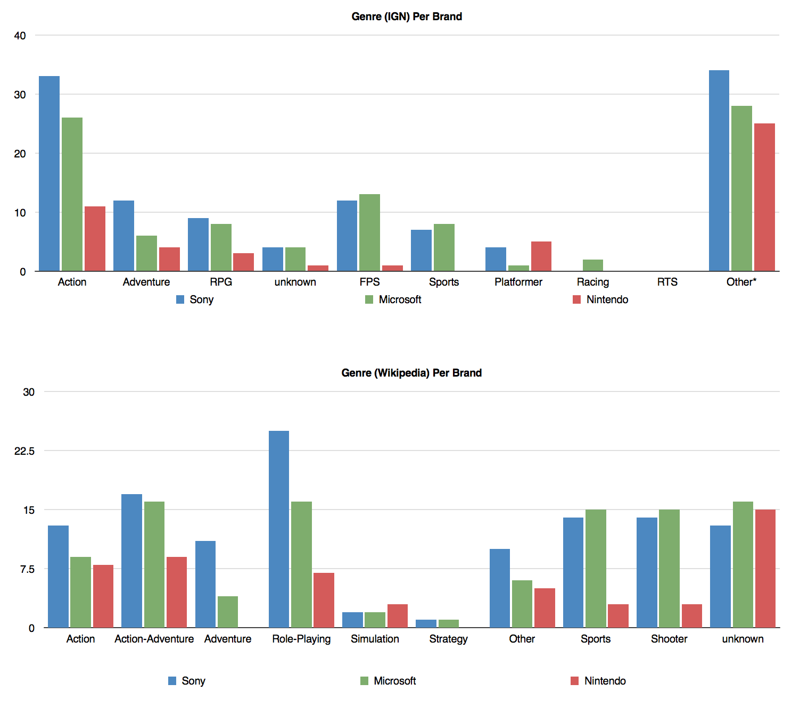

Continuing my research of video game genre and protagonist/main character gender, here is the collected data from E3 2014. The sample list of 152 video games was sourced from IGN's [Games at E3 2014](http://www.ign.com/wikis/e3/Games_at_E3_2014), platform data mapped to a quantifiable “TRUE”/”FALSE” list, genre lists collected from both IGN and Wikipedia (limited to primary genre), and the main character gender researched to the best of my ability.

Elaborating on the gender categories:

“Multi” being either:
a) multiple characters to select from (ie. _Mario Kart 8_ / _Killer Instinct_ receive 1 count for “multi” although there are several characters to select from)
b) customizable gender
c) large customizable party

“n/a” being a:
a) gender ambiguous character
b) God-view game
c) first-person with no direct gender association

Some key points:
- My data can be found [here](https://www.icloud.com/numbers/AwBUCAESEIn0l0Dj3DHr2__o8f9kK80aKf_PSznKno8EUf4HaJvuW-VFPDrbFwYtN58RYkn8d9zjGclszJoCPfXuMCUCAQEEICwOuQ-QWMq8X1YyH-kgw_cnxUymEQdIs_uc7qRX-aGK#E3_Games_List). (Numbers online)
- Sample size = 152 games
- 13 exclusively female protagonists/main characters vs. 47 exclusively male protagonists
- Female protagonists by year:
	- 2012: 2%
	- 2013: 6%
	- 2014: 9%

Additional reference:
- [E3 2013: Genre/Gender Breakdown](https://www.zerocounts.net/2013/06/15/e3-2013/) with E3 2012 data