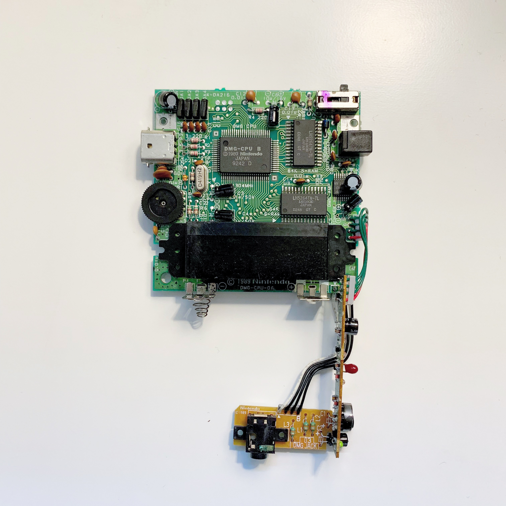

Today marks 30 years since the Game Boy’s initial release in Japan. After seeing loads of Game Boy tributes for the handheld, I decided to dig up my old system for a first-hand experience down memory lane.

It was in pretty shoddy condition — unable to power on, battery corrosion inside, possible paint markings on the back, and general grime throughout. I’ve been reluctant to open it up to attempt a repair, concerned about the reliability of the plastic around the screws after 30ish years.

Well, there’s no better time than Easter — a day of resurrection — to take a crack at it. At least I could say I tried to bring this gamer boy back into the world.

Throughout the teardown, I took a few photos of some of main unit and boards, [posting them to Instagram](https://www.instagram.com/_kylestarr/). [At the compliment of friend Sam Gross](https://twitter.com/samthegeek/status/1120087746993721345?s=21), I’ve decided to post them here as well.

My photo setup is nothing fancy:

- iPhone XS
- IKEA Malm desk (white)
- generic table lamp
- Philips Hue White Extension Bulb A19 E26
- Apple Photos app auto-enhance
- Instagram editing tools
- Video: Apple’s Clips app + Instagram’s ‘Lark’ filter

The Game Boy, pre-spa treatment:

Both sides of the brain:

Motherboard (3)

Display circuit board

I didn’t take a picture, but there was considerable battery corrosion on the battery contacts. This was the likely culprit of the power issue. To clean, I popped out the battery contacts and submerged them in distilled white vinegar for about 10–15 minutes. They came out looking brand new.

Once all of the guts had been removed, I took a baby wipe to the exterior and buttons. For interior grime, I soaked a Q-tip in the white vinegar and swabbed it out.

After all plastic had been cleaned, it was time for reassembly and the moment of truth…

https://youtu.be/3-OMIiliYXU

Happy 30th, Game Boy.

---

## Retr0bright Update

A restoration is not complete without attention paid to the appearance. The more I looked at the end result of my Game Boy restoration, the more I was bothered by the yellowing of the casing.

The yellowing of ‘80s and ‘90s electronics plastics is caused by a combination bromine — afire retardant — and exposure to UV light. The plastic is known as [acrylonitrile butadiene styrene, or ABS](https://en.m.wikipedia.org/wiki/Acrylonitrile_butadiene_styrene).

The method to reverse the effect of bromine is referred to as [retr0bright](http://www.retr0bright.com/) and includes a mixture of hydrogen peroxide, xanthan gum, glycerin, and “oxy” laundry booster. Being the lazy sap I am, I decided to opt in for a [discovered alternative](https://www.howtogeek.com/196687/ask-htg-why-do-old-computers-and-game-consoles-turn-yellow/): [Salon Care by Sally Beauty](https://www.amazon.com/Salon-Care-Creme-Developer-ounce/dp/B004OKDW20/ref=sr_1_2?crid=2OU4M2W3RT7NP&keywords=salon+care+40+volume+creme+developer&qid=1556807644&s=gateway&sprefix=salon+care%2Caps%2C206&sr=8-2).

Wearing latex gloves, painted a generous amount of the Salon Care on to the disassembled casing of the Game Boy, wrapped it in Stretch-Tite plastic wrap, and placed the piece outside in direct sunlight.

**Essential**: The Salon Care coated plastic should be exposed to UV light for 4–6 hours total. However, it is **critical** to massage the plastic wrap + Salon Care every 45–60 minutes or so. This helps avoid air bubbles which can contribute to blotchiness in the end result. (This is where I goofed.) Likewise, you should rinse the plastic and re-apply the Salon Care every 90–120 minutes as it begins to evaporate after lengthy exposure. (Another goof of mine. I had to redo the process the next day as the Salon Care seemed to lose its effect after about 2 hours.)

After the process was complete — which is to say the color reversal was at a point that was good enough for me — I rinsed and thoroughly dried the plastic and reassembled the Game Boy and photographed a side-by-side before and after:

If you look closely, you will notice some of the blotchiness I mentioned above.

Overall, I’m quite satisfied with the end result. This restored Game Boy teleports me back to Christmas 1989, unwrapping my first console ever, and playing _Super Mario Land_ for hours on end.