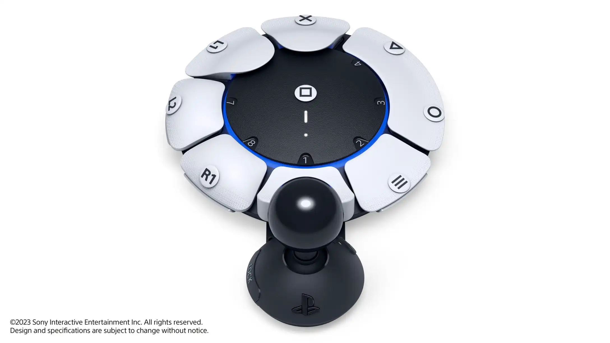

[Playstation.Blog](https://blog.playstation.com/2023/01/04/introducing-project-leonardo-for-playstation-5-a-highly-customizable-accessibility-controller-kit/):

> Through conversations with accessibility experts and incredible organizations like [AbleGamers](https://ablegamers.org/), [SpecialEffect](https://www.specialeffect.org.uk/) and [Stack Up](https://www.stackup.org/), we’ve designed a highly configurable controller that works in tandem with many third-party accessibility accessories and integrates with the PS5 console to open up new ways of gaming. It is built to address common challenges faced by many players with limited motor control, including difficulty holding a controller for long periods, accurately pressing small clusters of buttons or triggers, or positioning thumbs and fingers optimally on a standard controller.

This is the most exciting news I've seen out of CES this year.

Project Leonardo comes nearly five years after the Xbox Adaptive Controller was announced, but much better late than never. And coming in at a distant second means Sony has surely incorporated a lot of feedback about the Xbox Adaptive Controller into the design of Project Leonardo.

> Project Leonardo can be used as a standalone controller or paired with additional Project Leonardo or DualSense wireless controllers. Up to two Project Leonardo controllers and one DualSense wireless controller can be used together as a single virtual controller, allowing players to mix and match devices to fit their particular gameplay needs, or to play collaboratively with others.
>
> For example, players can augment their DualSense controller with a Project Leonardo controller or use two Project Leonardo controllers on their own. A friend or family member can also assist by helping to control the player’s game character with a DualSense controller or a second Project Leonardo controller. The controllers can be dynamically turned on or off and used in any combination.

The design of Project Leonardo is radically different from the Xbox Adaptive Controller. The sheer fact that hardware itself is highly customizable, from physical button layout to analog stick distance and size, let alone the ability to map buttons together and pair this device with a DualSense for individual comfort or collaborative, assistive needs, the combinations are seemingly endless. I'd be stunned if some [curb cut effects](https://en.wikipedia.org/wiki/Curb_cut_effect) don't come out of all of this flexibility.

So Morimoto, Designer, Sony Interactive Entertainment:

> “Because players can customize Project Leonardo according to their needs, there is no one ‘right’ form factor. We want to empower them to create their own configurations. The controller can also flexibly accept combinations of accessibility accessories to create a unique aesthetic. I am excited that the design will be completed through collaboration with players rather than presenting them with a single form factor.”

Competition fuels innovation, and the accessibility space can never receive enough innovation. I'm eager to see the informed reception and comparisons between Project Leonardo and the Xbox Adaptive Controller, and how accessibility in gaming evolves from here.
